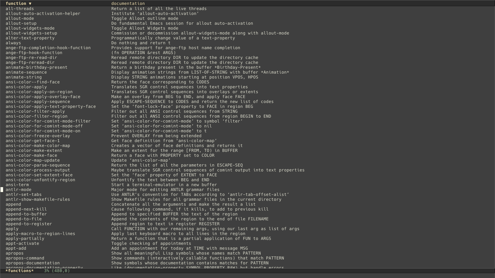
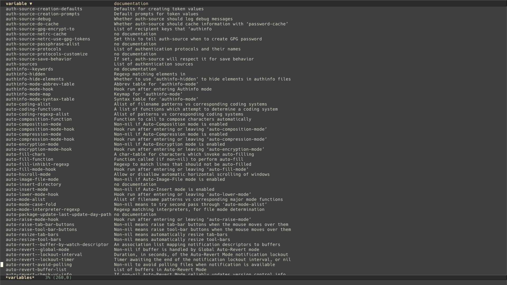

# symbol-menu
List variable and function with tabulated view.

## Config example

``` elisp
(use-package symbol-menu
  :load-path <path-to-symbol-menu>
  :commands (list-functions list-variables))
```
If you have performance issue for `list-functions`, consider disable sorting by

``` elisp
(setq symbol-menu-should-sort-p nil)
```

It is recommended to install [tablist](https://github.com/politza/tablist) for more features like mark and filter.
For example, after adding below snippet to your config:

``` elisp
(use-package tablist
  :hook (tabulated-list-mode . tablist-minor-mode))
```

Now you can press `/ r <regex> RET` to filter function/variable name by regular expression.
Press `/ p` will pop up to previous state.

## Screenshot



